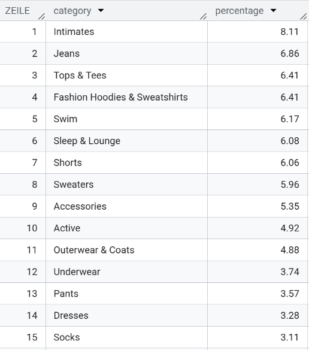
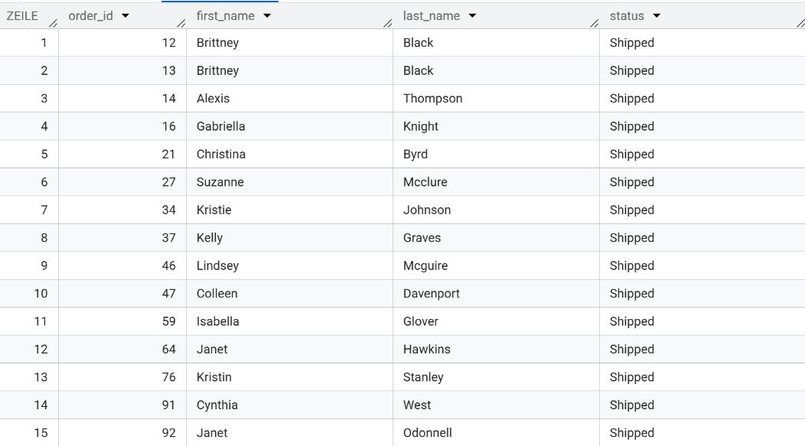
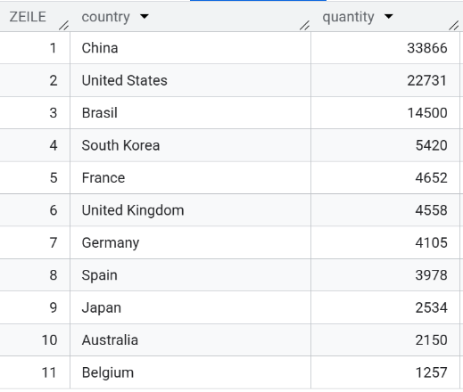

# eCommerce Data Research: TheLook & Marketing Analysis

- [Project Overview](#project-overview)
- [Technical Stack](#technical-stack)
- [Part 1 – Data Exploration](#part-1--data-exploration)
  - [Task 1: Getting to Know Users](#task-1-getting-to-know-users)
  - [Task 2: Top Product Categories](#task-2-top-product-categories)
  - [Task 3: Order Analysis (JOIN)](#task-3-order-analysis-join)
  - [Task 4: Most Expensive Orders](#task-4-most-expensive-orders)
  - [Task 5: Users Geography](#task-5-users-geography)
- [Part 2 – Revenue & Customer Analysis](#part-2--revenue--customer-analysis)
- [Part 3 – Forecasting & Strategic Recommendations](#part-3--forecasting--strategic-recommendations)

## Project Overview

This project is a comprehensive data investigation structured in multiple stages.

**Part 1 – Data Exploration**

We begin by exploring the **theLook eCommerce public dataset** using **SQL** to understand user behavior, sales patterns, and product performance.

**Part 2 – Revenue & Customer Analysis**

 In this stage, transactional data is analyzed to evaluate revenue dynamics, customer behavior, and discount effectiveness.

 The analysis includes:

- Monthly revenue trend analysis (since January 2022)  
- Comparison of discounted vs. full-price purchases  
- Customer segmentation by gender and age group  
- Product category performance across demographics  
- Identification of high-value customer segments  

The results are presented in an interactive Tableau dashboard with key KPIs and filters to support executive-level decision-making.

**Part 3 – Forecasting & Strategic Recommendations**

 Using **Tableau, Power BI, Google Sheets**, and Python libraries (**Pandas, NumPy, Matplotlib, Seaborn, Scikit-learn, Statsmodels**), we build predictive models — including **linear regression** and **state-space models (SM models)** — to forecast sales and generate actionable strategic insights.

## Technical Stack
* **SQL Engine:** Google BigQuery.
* **Data Manipulation:** Python (Pandas, Numpy).
* **Visualization:** Tableau, Power BI, Matplotlib, Seaborn.
* **Predictive Modeling:** Scikit-learn, Statsmodels (Linear Regression / SM Models).

## Part 1 – Data Exploration 

 Task #1: Getting to Know Users 

**Description:**   
Extract user profiles of customers from **Brazil** who registered on the platform during **2023**.

**Explanation:**  
 This query filters users by geographic location and registration date to analyze regional acquisition trends.  
 The resulting dataset supports further analysis of user growth dynamics, cohort behavior, and market performance in Brazil.

> **Result Screenshot:**
> 

Task #2: Top Product Categories

**Description:**  
Determine the inventory structure by calculating the percentage share of each product category. 

**Explanation:**   
Using SQL window functions, I computed the relative contribution of each category to the overall inventory volume. This approach allows for identifying the most stocked categories and assessing the warehouse distribution structure.

> **Result Screenshot:**
> 

Task #3: Order Analysis (JOIN)

**Description:**  
 Merge the orders and users tables. Output the order_id, customer first_name, last_name, and order status for all orders that have a status of 'Shipped'.

**Explanation:**  
This query combines transactional and customer-level data to isolate successfully fulfilled orders.  
The resulting dataset serves as a clean foundation for revenue tracking, fulfillment analysis, and customer behavior insights.

> **Result Screenshot:**
> 

Task #4: The Most Expensive Orders

**Description:**  
 Identify the top 10 highest-value transactions.

**Explanation:**  
 I aggregated the total sale amount for each unique order to determine the top 10 most expensive purchases.  
 This analysis highlights high-value transactions, helps identify potential VIP customers, and provides insight into maximum basket size and revenue concentration.

> **Result Screenshot:**
> 

Task #5: Users Geography

**Description:**  
 Count the number of unique users (users table) in each country. Output only those countries where the number of users exceeds 500. 

**Explanation:** 
 I calculated the number of distinct users per country and filtered for markets with more than 500 registered users to identify regions with a significant customer base.  
 This analysis helps highlight key geographic markets with strong platform adoption and supports regional performance evaluation.

> **Result Screenshot:**
> 

### 📂 File Locations
* **sql/queries.sql** – All SQL queries used in this research
* **visuals/sql_results/** – Screenshots of query results

### Key Findings

- **Top Categories:** Intimates (8.11%), Jeans (6.86%), Tops & Tees (6.41%), Fashion Hoodies & Sweatshirts (6.41%), Swim (6.17%)  
- **Most Expensive Orders:** $1,128.95 – $1,372.00  
- **Top Countries by Users (>500):**  
  China (33,866), United States (22,731), Brazil (14,500), South Korea (5,420), France (4,652), United Kingdom (4,558)
