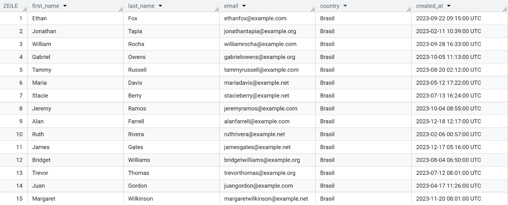
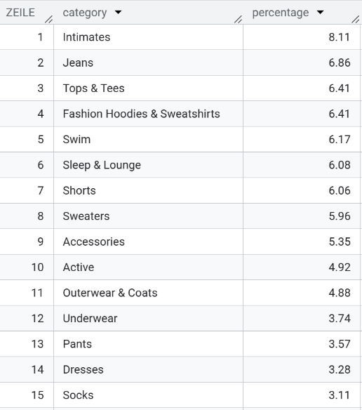
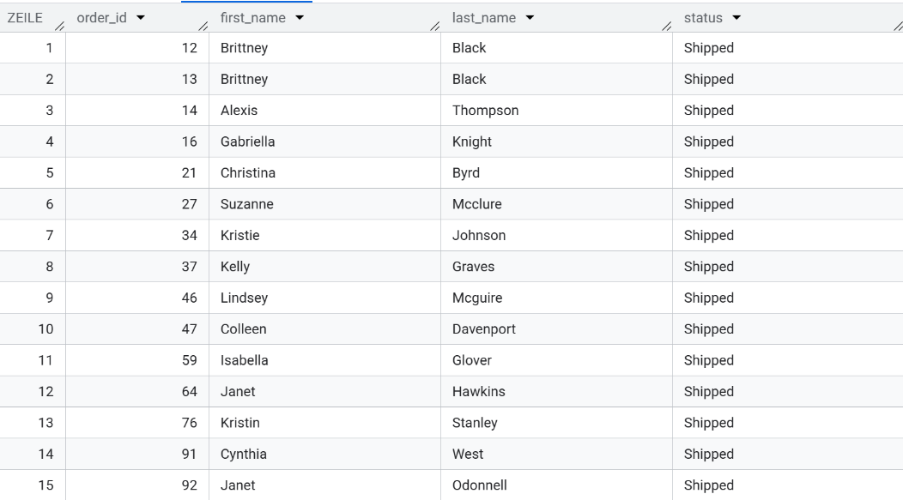
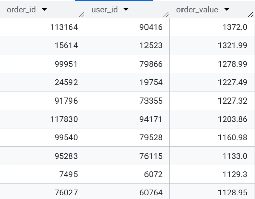
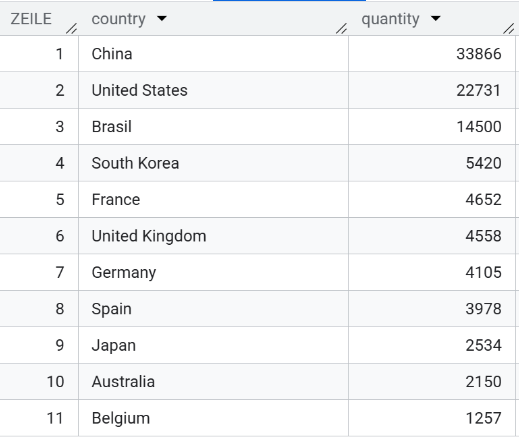
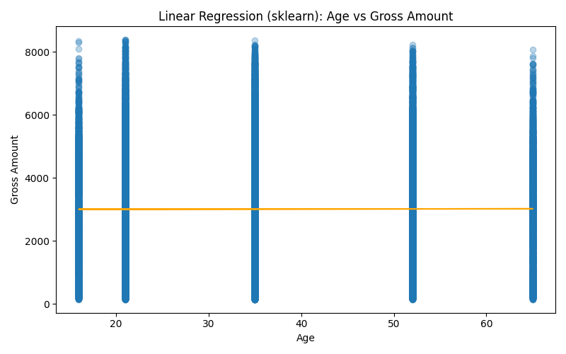
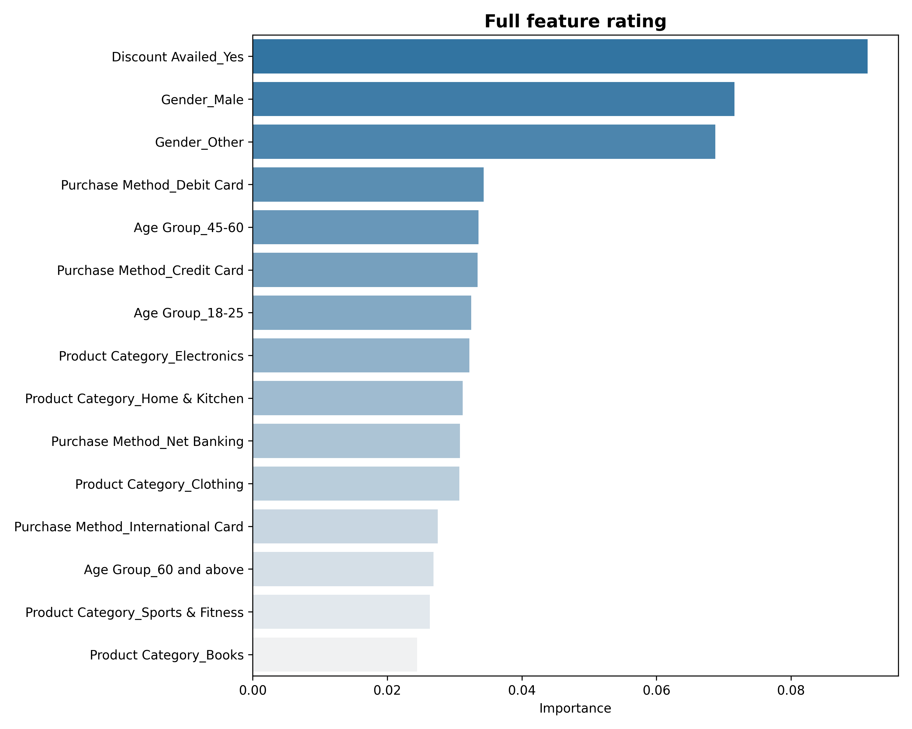

# eCommerce Data Research: TheLook & Marketing Analysis

- [Project Overview](#project-overview)
- [Technical Stack](#technical-stack)
- [Part 1 – Data Exploration](#part-1--data-exploration)
  - [Task 1: Getting to Know Users](#task-1-getting-to-know-users)
  - [Task 2: Top Product Categories](#task-2-top-product-categories)
  - [Task 3: Order Analysis (JOIN)](#task-3-order-analysis-join)
  - [Task 4: Most Expensive Orders](#task-4-most-expensive-orders)
  - [Task 5: Users Geography](#task-5-users-geography)
- [Part 2 – Revenue & Customer Analysis](#part-2--revenue--customer-analysis)
- [Part 3 – Forecasting & Strategic Recommendations](#part-3--forecasting--strategic-recommendations)

## Project Overview

This project is a comprehensive data investigation structured in multiple stages.

**Part 1 – Data Exploration**

We begin by exploring the **theLook eCommerce public dataset** using **SQL** to understand user behavior, sales patterns, and product performance.

**Part 2 – Revenue & Customer Analysis**

 In this stage, transactional data is analyzed to evaluate revenue dynamics, customer behavior, and discount effectiveness. 

The results are presented in an interactive Tableau dashboard with key KPIs and filters to support executive-level decision-making.

**Part 3 – Forecasting & Strategic Recommendations**

 Using **Tableau, Power BI, Google Sheets**, and Python libraries (**Pandas, NumPy, Matplotlib, Seaborn, Scikit-learn, Statsmodels**), we build predictive models — including **linear regression** and **state-space models (SM models)** — to forecast sales and generate actionable strategic insights.

## Technical Stack
* **SQL Engine:** Google BigQuery.
* **Data Manipulation:** Python (Pandas, Numpy).
* **Visualization:** Tableau, Power BI, Matplotlib, Seaborn.
* **Predictive Modeling:** Scikit-learn, Statsmodels (Linear Regression / SM Models).

## Part 1 – Data Exploration

 Task #1: Getting to Know Users 

**Description:**   
Extract user profiles of customers from **Brazil** who registered on the platform during **2023**.

**Explanation:**  
 This query filters users by geographic location and registration date to analyze regional acquisition trends.  
 The resulting dataset supports further analysis of user growth dynamics, cohort behavior, and market performance in Brazil.

> **Result Screenshot:**
> 

Task #2: Top Product Categories

**Description:**  
Determine the inventory structure by calculating the percentage share of each product category. 

**Explanation:**   
Using SQL window functions, I computed the relative contribution of each category to the overall inventory volume. This approach allows for identifying the most stocked categories and assessing the warehouse distribution structure.

> **Result Screenshot:**
> 

Task #3: Order Analysis (JOIN)

**Description:**  
 Merge the orders and users tables. Output the order_id, customer first_name, last_name, and order status for all orders that have a status of 'Shipped'.

**Explanation:**  
This query combines transactional and customer-level data to isolate successfully fulfilled orders.  
The resulting dataset serves as a clean foundation for revenue tracking, fulfillment analysis, and customer behavior insights.

> **Result Screenshot:**
> 

Task #4: The Most Expensive Orders

**Description:**  
 Identify the top 10 highest-value transactions.

**Explanation:**  
 I aggregated the total sale amount for each unique order to determine the top 10 most expensive purchases.  
 This analysis highlights high-value transactions, helps identify potential VIP customers, and provides insight into maximum basket size and revenue concentration.

> **Result Screenshot:**
> 

Task #5: Users Geography

**Description:**  
 Count the number of unique users (users table) in each country. Output only those countries where the number of users exceeds 500. 

**Explanation:** 
 I calculated the number of distinct users per country and filtered for markets with more than 500 registered users to identify regions with a significant customer base.  
 This analysis helps highlight key geographic markets with strong platform adoption and supports regional performance evaluation.

> **Result Screenshot:**
> 

### Key Findings

- **Top Categories:** Intimates (8.11%), Jeans (6.86%), Tops & Tees (6.41%), Fashion Hoodies & Sweatshirts (6.41%), Swim (6.17%)  
- **Most Expensive Orders:** ₹1,128.95 – ₹1,372.00  
- **Top Countries by Users (>500):**  
  China (33,866), United States (22,731), Brazil (14,500), South Korea (5,420), France (4,652), United Kingdom (4,558)

### 📂 File Locations
* **sql/queries.sql** – All SQL queries used in this research
* **visuals/sql_results/** – Screenshots of query results

## Part 2 – Revenue & Customer Analysis

Data Preparation & EDA

------
 
Data preparation and cleaning for subsequent analysis of sales, discount effectiveness, and customer behavior.

**ETL Steps & Initial Analysis**

1. **Data Import & Structure**
- 55,000 transactions with 13 attributes (5 numerical, 7 categorical).  
- `Purchase Date` converted to datetime for time-series analysis.

2. **Data Cleaning**
- Duplicates removed – 0 found.  
- Missing values in `Discount Name` (27,585) filled with `'No Discount'`.

3. **Customer Demographics**
- Gender: Female 33.55%, Male 32.9%, Other 33.54%.  
- Age groups: 18–25 (29.87%), 25–45 (40.02%).

4. **Geography**
- Main cities: Mumbai 20.36%, Delhi 19.63%; top 4 cities account for 55% of all orders.

5. **Financials**
- Average transaction value: 3,012.94; Maximum: 8,394.83.  
- VIP transactions (>8,000) identified – 52 records.

6. **Anomalies**
- 613 transactions (1.1%) with negative Net Amount due to discounts exceeding the gross amount.  
- Added `is_overflow_discount` flag for correct exclusion from analytics without losing original data.

Data Visualization (Tableau)

  
All financial insights are based on validated data. Transactions with discount values exceeding product price were excluded from revenue calculations to ensure accurate and reliable reporting.

1. Revenue Dynamic (2022–2024) 

**Task description:**  
Construct a Line Chart of total sales by month, starting from January 2022 to the present. 

> **Chart Screenshot:**
> .png)

### Key Insights:

* **Sustained Business Growth:** Revenue shows a consistent upward trajectory over the analyzed period. This indicates stable market expansion and the successful scaling of eCommerce operations.
* **Strong Seasonal Performance:** December consistently delivers peak revenue results, with the highest performance recorded in December 2023 at **₹3.9M**. This confirms the high effectiveness of holiday campaigns and year-end sales strategies as primary revenue drivers.
* **Predictable Post-Holiday Slowdown:** A recurring sales decline is observed each February, reaching the lowest point of approximately **~₹2.0M**. This reflects a typical post-season retail contraction.
* **Strategic Opportunity:** The February dip presents a clear opportunity for implementing targeted customer retention programs or early-year promotional strategies to smooth out performance fluctuations.

2. Impact of Discounts on Average Order Value (AOV)

**Task description:**  
Create a bar chart that compares the average check (net amount and gross amount) for purchases made with a discount (Discount Applied) and purchases made at full price. Add value labels to the chart. 

> **Chart Screenshot:**
> 

### Key Insights:
1. **Incentivizing Higher Spending:** The **Avg. Gross Amount** is higher for discounted orders (₹3,174.0₹) than for full-price orders (₹3,106.9₹). This suggests that discounts encourage customers to add more expensive items or more products to their cart (Upselling effect).
2. **Revenue Trade-off:** While discounts increase the "gross" value of the basket, the **Avg. Net Amount** (actual revenue) drops by approximately **6.6%** compared to non-discounted orders (₹2,901.2₹ vs ₹3,106.9₹).
3. **Strategic Conclusion:** The current discount strategy is effective at increasing the transaction volume and basket size. However, the business should monitor whether the increase in the total number of orders compensates for the lower net profit margin per order.

3. Customer Preferences by Age Group

**Task description:**  
Question: "What product categories (Electronics, Clothing, Home Decor, etc.) are popular across different age groups?" Choose the visualization type that best shows this relationship.

> **Chart Screenshot:**
> 

### Key Insights:

* **The Prime Segment:** The **25-45 age group** is the primary revenue driver, with a total gross amount exceeding **65M**. 
* **Electronics Spending Leader:** This group (25-45) spends the most on Electronics in absolute terms—**20.1M**—which is significantly higher than any other demographic.
* **Secondary Market:** The **18-25 group** follows as the second-largest segment, contributing **14.8M** to the Electronics category.
* **Comparison of Demographics:** While younger and older groups (under 18 and 60+) have similar *proportional* interests, their *actual* financial contribution is much smaller (approx. **2-3M** per category).

Analytical Questions (Business Case)

**Task description:**  
Compare two groups of customers: Group A (men) and Group B (women). Also further divide these groups by age category.
* Which group of customers brings the company more total revenue (Total net Revenue)?
* Which group has the highest average check?
* Which group is more likely to buy goods at a discount?

> **Chart Screenshot:**
> 

### Key Insights:

- **Primary Revenue Driver:** The 25–45 age group generates the highest revenue — approximately **₹63.9M**.

- **Balanced Gender Contribution (25–45):**
  - Group A (Males): **₹21.1M**
  - Group B (Females): **₹21.2M**
  - Other: **₹21.6M**

- **Minimal Gender Gap:** Less than **0.5%** difference between males and females in the top-performing segment.

- **Secondary Segment:** The 18–25 age group contributes nearly **₹47M**, with similarly balanced gender distribution.

- **Low-Engagement Segments:** Under 18 and 60+ groups generate the lowest revenue (around **₹8M** each), indicating limited engagement or growth potential.

> **Chart Screenshot:**
> 

### Key Insights

- **Highest Overall AOV:** The **Other** category within the **25–45** age group has the highest Average Order Value at **₹2,942.1**.

- **Leading Segment (Under 18):** Males show the highest AOV at **₹2,938.6**, compared to Females at **₹2,876.2**.

- **Leading Segment (60+):** The **Other** gender leads with an AOV of **₹2,898.5**, slightly above Females at **₹2,892.7**.

- **Lowest AOV:** Females aged **45–60** record the lowest average order value at **₹2,819.7**.

- **Stable Pricing Pattern:** Most demographic segments fall within the **₹2,800–₹2,950** range, indicating a consistent and stable pricing strategy across groups.
> **Chart Screenshot:**
> 

### Key Insights

- The **Under 18 (Other gender)** segment has the highest share of discounted orders, indicating the strongest price sensitivity among all demographic groups.

- For the **Other gender**, discount affinity gradually decreases with age, suggesting that younger customers in this segment are significantly more promotion-driven.

- Both **Male** and **Female** segments show increasing discount affinity with age, highlighting the growing importance of promotions for older customers.

- The **Male** segment demonstrates a relatively stable and consistent upward trend across age groups.

- The **Female** segment shows greater variability, though the overall direction also indicates increasing sensitivity to discounts with age.

### Conclusion

- **Revenue:** Men (Group A) and Women (Group B) generate nearly identical total revenue, with the 25–45 age group being the primary revenue driver overall. This indicates that age plays a more significant role than gender in revenue contribution.

- **Average Order Value (AOV):** Differences in AOV between genders are minimal, with most segments falling within a narrow ₹2,800–₹2,950 range. This suggests a stable and consistent pricing structure across demographic groups.

- **Discount Sensitivity:** Younger customers are generally more promotion-driven, particularly within the Other gender category. Among Men and Women, discount affinity increases with age, indicating stronger responsiveness to promotions in older segments.

### 📂 File Locations
* **notebooks/EDA_Ecommerce.ipynb** – Data preparation code
* **visuals/tableau/** – Screenshots of charts

## Part 3 – Forecasting & Strategic Recommendations

### Key Findings

Linear Regression Analysis

> **Chart Screenshot:**
> 

- The linear regression model produced an **R² ≈ 0.000**, indicating that age explains virtually none of the variance in customer spending.
- All p-values for age groups were **> 0.05**, confirming that age is not statistically significant.

**Conclusion:**  
Age is **not a statistically significant predictor** of purchase behavior in this dataset.

Machine Learning Insight (Random Forest)

> **Chart Screenshot:**
> 

- Feature importance analysis from the **Random Forest** model identified:
  - **Discount Availed**
  - **Gender**  
  as the strongest predictors of purchase value.
- Age groups ranked significantly lower in importance.

**Conclusion:**  
Machine learning results confirm that age has **minimal impact** on transaction value compared to other features.

---

**Data Interpretation**

> **Chart Screenshot:**
> 

- Tableau visualization showed a “peak” in total sales within the **25–45 age group**.
- However, this peak is driven by:
  - A larger customer base in that segment,
  - Not higher average spending per customer.

**Conclusion:**  
Higher total sales in this age group reflect customer volume rather than stronger individual purchasing power.

## Business Recommendation

- Focus marketing strategies on:
  - **Discount optimization**
  - **Gender-based personalization**
- Avoid prioritizing age-based segmentation for increasing average transaction value.

**Overall Insight:**  
Within this dataset, **discount strategies and gender segmentation** are the primary revenue drivers, while age does not significantly influence spending behavior.

### 📂 File Locations
* **notebooks/Linear_reg_Ecommerce.ipynb** – Code of Linear Regression and Random Forest Regression
* **visuals/charts** – Charts
* **visuals/tableau/Total Purchase Amount by Age Group.png** – Chart of Total Purchase Amount by Age Group